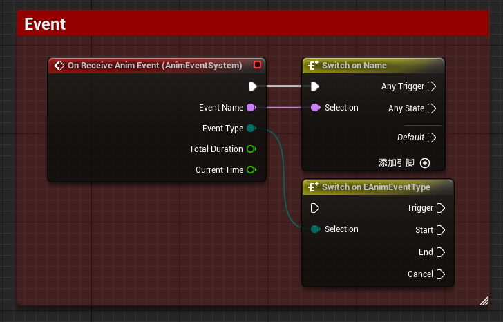

# AnimEventSystem
> Language: [English](README.md), [中文](README-CN.md)

一个为Unreal Engine设计的轻量级动画事件系统，旨在实现动画层与蓝图逻辑层之间的解耦通信，允许在动画播放期间将事件高效地分发至蓝图。

## 使用方法
该插件的使用特别简单，你只需要关注一个组件，一个事件和一个AnimNotify即可。

1. 为骨骼网格体组件所在Actor上添加一个`Anim Event System`组件。

    

2. 在想要发送事件的动画中添加一个`Send Anim Event`的AnimNotify或AnimNotifyState，并填写事件名称。

    

    

3. 在蓝图侧绑定`Anim Event System`组件的`On Receive Anim Event`事件。

    

    - Event Name: 事件名称，与AnimNotify中填写的名称一致。
    - Event Type: 事件类型，对于从AnimNotify发送的事件，类型为`Trigger`，而对于AnimNotifyState发送的事件，具有`Start`和`End`两种类型。目前，`Cancel`类型的事件暂未被使用。
    - Total Duration: 动画持续时间。
    - Current Time: 动画当前播放时间。

## 关于PR
如果你对该系统有任何改进建议或想法，欢迎提交PR！我们非常欢迎和感谢社区的参与和贡献。
请确保你的PR遵循以下几点：
1. PR应包含清晰的描述，说明你所做的更改和目的。
2. PR应遵循代码风格和规范，以保持代码的一致性和可读性。
3. PR应包含必要的文档更新，以便其他人能够理解你的更改。

## 许可证
本项目采用MIT许可证，详情请查看[LICENSE](LICENSE)文件。