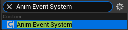
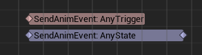
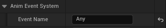

# AnimEventSystem
> Language: [English](README.md), [中文](README-CN.md)

A lightweight animation event system designed for Unreal Engine, aimed at decoupling communication between the animation layer and the blueprint logic layer, allowing efficient event dispatch to blueprints during animation playback.

## Usage
This plugin is extremely simple to use. You only need to focus on one component, one event, and one AnimNotify.

1. Add an `Anim Event System` component to the Actor that owns the skeletal mesh component.

    

2. Add a `Send Anim Event` AnimNotify or AnimNotifyState to the animation where you want to send events, and specify the event name.

    

    

3. Bind the `On Receive Anim Event` event of the `Anim Event System` component in the blueprint.

    

    - Event Name: The name of the event, which should match the name specified in the AnimNotify.
    - Event Type: The type of the event. For events sent from AnimNotify, the type is `Trigger`. For events sent from AnimNotifyState, the types are `Start` and `End`. Currently, the `Cancel` event type is not used.
    - Total Duration: The total duration of the animation.
    - Current Time: The current playback time of the animation.

## About PRs
If you have any suggestions or ideas for improving this system, feel free to submit a PR! We greatly welcome and appreciate community participation and contributions.
Please ensure your PR adheres to the following guidelines:
1. The PR should include a clear description explaining the changes you made and their purpose.
2. The PR should follow the coding style and conventions to maintain code consistency and readability.
3. The PR should include necessary documentation updates to help others understand your changes.

## License
This project is licensed under the MIT License. For details, please refer to the [LICENSE](LICENSE) file.